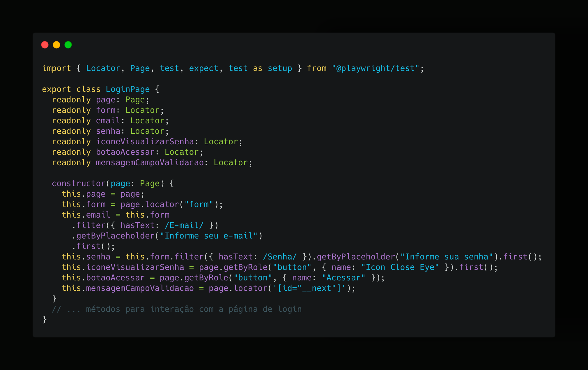

# BugBank Automation Project

[](https://playwright.dev/)
[](https://www.typescriptlang.org/)
[](https://nodejs.org/)

## Sobre o Projeto

Este repositório contém a solução desenvolvida durante o **hands-on** do workshop **"Automação de Testes com Playwright: Além dos Testes E2E"**, demonstrando na prática:

- Implementação do Page Object Model (POM)
- Padrões de automação de testes
- Boas práticas com Playwright e TypeScript

🔗 **[Apresentação do Workshop](https://gamma.app/embed/5mf85jgtg27uimt)**

## Tecnologias Utilizadas

- **Playwright**
- **TypeScript**
- **Node.js**

## Estrutura do Projeto

```bash
bugbank-automation/
├── tests/               # Arquivos de teste
├── pages/               # Page Objects
├── utils/               # Configurações
├── reports/             # Relatórios gerados
├── .env                 # Variáveis de ambiente
├── package.json         # Dependências do projeto
└── playwright.config.ts # Configuração do Playwright
```

Exemplo de page object (`LoginPage.ts`):


## Como Começar

## Pré-requisitos

- node.js (versão 18 ou superior)
- npm ou yarn

## Instalação

1. Clone o repositório:

```bash
git clone https://github.com/seuusuario/bugbank-automation.git
cd bugbank-automation
```

2. Instale as dependências:

```bash
npm install
```

## Configuração

Crie um arquivo .env na raiz do projeto com as seguintes variaveis:

```bash
 EMAIL=""
 SENHA=""
```

## Execução dos Testes

```bash
 npm run test
```

## Como Contribuir

1. Faça um fork do projeto
2. Crie sua branch (git checkout -b feature/nova-funcionalidade)
3. Commit suas alterações (git commit -m 'Adiciona nova funcionalidade')
4. Push para a branch (git push origin feature/nova-funcionalidade)
5. Abra um Pull Request

## Contato

Jessica Silva - contato.jessferreira@icloud.com

🔗 Link do Projeto: https://github.com/jessicaSilva0/bugbank-automation

## Créditos

Este projeto foi desenvolvido como parte do desafio prático do workshop, utilizando como base a aplicação [BugBank](https://github.com/jhonatasmatos/bugbank-ui), projeto open source criado por [Jhonatas Matos](https://github.com/jhonatasmatos).

Workshop concebido e ministrado com 💛 por [Jessica Silva](https://github.com/jessicaSilva0).
